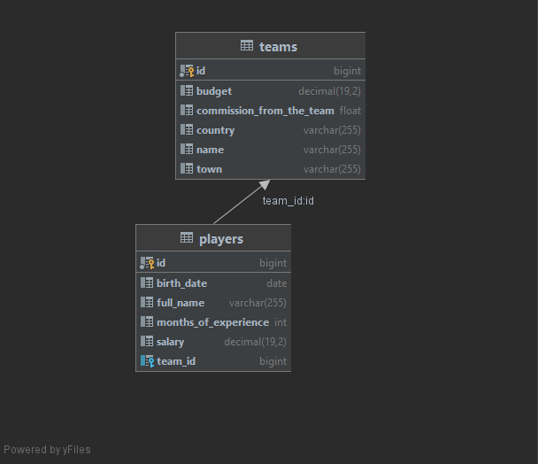

## Implementation details and technologies

### Project based on 3-layer architecture:
>- Presentation layer (controllers)
>- Application layer (services)
>- Data access layer (Repositories)

### Technologies
>- Spring Boot
>- MySQL
>- Lombok
>- Maven

### Diagram DB

## Setup
>1. run mvn clean package
>2. Install MySQL(V - 8.0)
>3. Create new schema, change name your database, password and user in application.properties